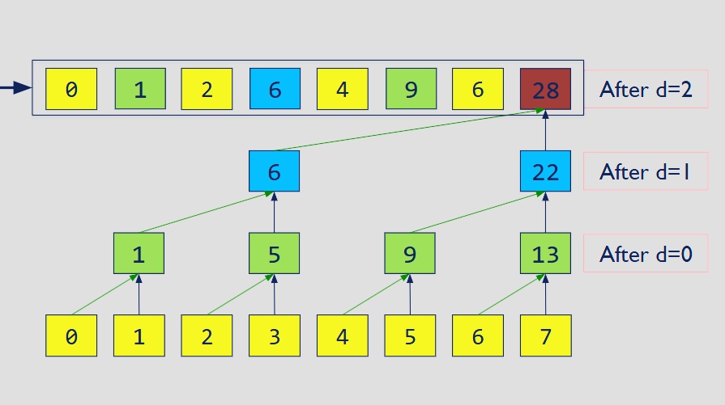
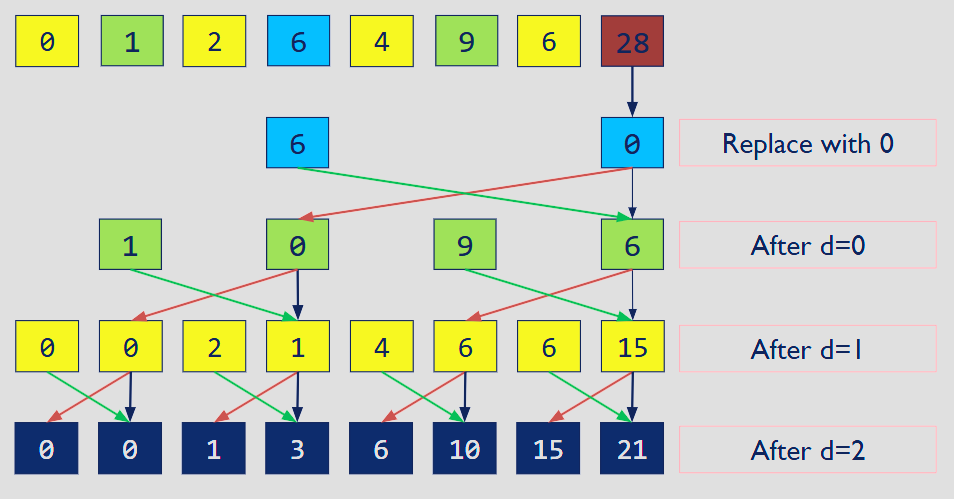
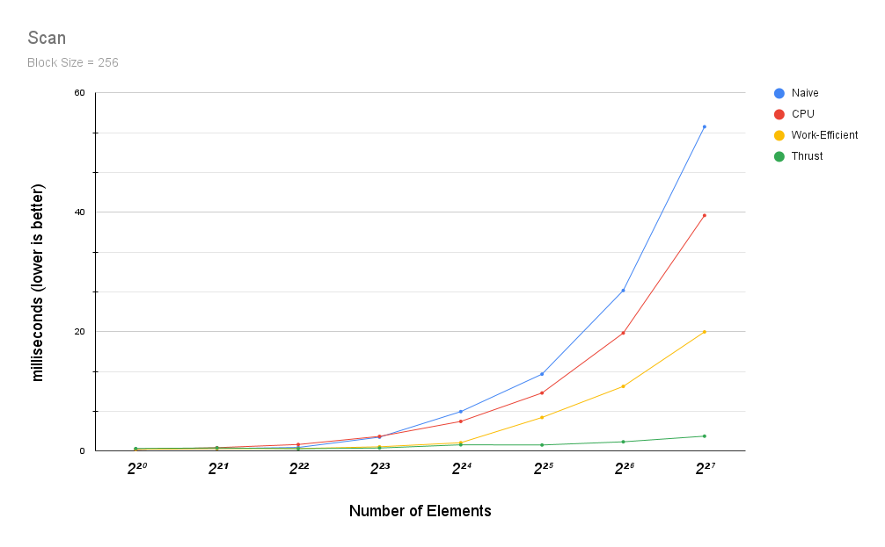
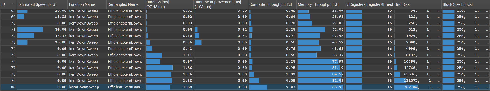

CUDA Stream Compaction
======================

**University of Pennsylvania, CIS 5650: GPU Programming and Architecture, Project 2**

* Ruben Young
  * [LinkedIn](https://www.linkedin.com/in/rubenaryo/), [Personal Site](https://rubenaryo.com)
* Tested on: Windows 11, AMD Ryzen 7 7800X3D, RTX 4080 SUPER (Compute Capability 8.9)

## Stream Compaction

### Overview
Stream Compaction is an algorithm with the simple goal of copying elements from one array to another if they fulfill a certain condition. For our purposes we will be filtering out all zero elements.

This serves as a convenient algorithm not just for demonstrating the capabilities of parallel processing, but also tinkering with and understanding optimization for highly parallel algorithms. We will be analyzing the performance of one of its core components, the exclusive scan.

### Naive Scan Implementation

The naive approach is to simply add elements in stages, offsetting the read index by increasing powers of two. This simple approach is fast to implement but has many problems, such as:

* Many more addition operations than a sequential CPU approach. O(n) -> O(n * log2(n))
* Cannot be done in-place, as multiple threads are reading and writing to the same indices

<div style="margin-left: auto;
            margin-right: auto;
            width: 100%">
            
|  | 
|:--:| 
| *From GPU Gems 3* |

</div>

### Work-Efficient Scan Implementation

A much more work-efficient approach is to treat the input array instead as a balanced tree, performing an "up-sweep" stage that performs a parallel reduction that creates staggered partial sums, followed by a "down-sweep" which stitches them together to arrive at the final scan. 

This version is vastly superior to the naive approach, as it avoids the increased addition operations and can be performed in-place.

|  |  |
|:--:                  |:--:                    |
| Up-Sweep             |  Down-Sweep            
*From CIS5650 at the University of Pennsylvania*

### Thrust Scan Implementation

As a baseline, we also compare against using ```thrust::exclusive_scan``` from NVIDIA's *Thrust* library. More details below on their underlying implementation.

## Performance Analysis

### Block Size

Testing different block sizes up to CUDA's 1024 maximum shows no significant difference or trend in measurements.

| Block Size | Naive (POW2) | Naive (Non-POW2) | Work-Efficient (POW2) | Work-Efficient (Non-POW2) |
| ---------- | ------------ | ---------------- | --------------------- | ------------------------- |
| 128        | 27.71        | 27.19            | 10.79                 | 10.92                     |
| 256        | 27.19        | 27.71            | 10.51                 | 10.48                     |
| 512        | 27.90        | 27.43            | 10.63                 | 9.71                      |
| 1024       | 27.47        | 26.83            | 9.84                  | 10.28                     |

*Results are in milliseconds, lower is better. <br>
Tested with N = 2<sup>26</sup> (~67M) 4-byte integers. <br>
Non-POW2 tested with N - 3.*

### Scan

Measuring Scan performance yielded some interesting insights. Despite the naive method's drawbacks, I did not expect that it would be so consistently beaten by the sequential CPU approach even at high N's. This goes to show the severity of multiplying the number of additions by log(n) at higher element counts. 

This testing clearly shows the superior performance of the work-efficient approach compared to the naive. 



|                | 2²⁰  | 2²¹  | 2²²  | 2²³  | 2²⁴  | 2²⁵   | 2²⁶   | 2²⁷   |
| -------------- | ---- | ---- | ---- | ---- | ---- | ----- | ----- | ----- |
| Naive          | 0.37 | 0.42 | 0.62 | 2.34 | 6.63 | 12.90 | 26.92 | 54.34 |
| CPU            | 0.30 | 0.59 | 1.12 | 2.48 | 4.98 | 9.74  | 19.79 | 39.49 |
| Work-Efficient | 0.32 | 0.42 | 0.44 | 0.73 | 1.41 | 5.64  | 10.85 | 19.98 |
| Thrust         | 0.43 | 0.55 | 0.40 | 0.53 | 1.07 | 1.03  | 1.57  | 2.51  |

### What makes Thrust so much better than my implementation?

The biggest flaw in my implementation comes from an over-reliance on global memory. The intermediate scratch buffers which my function uses to perform the scan all exist on global memory for simple and consistent access across thread blocks. However, GPU Gems' implementation of the same algorithm uses shared memory instead, which results in many less thread stalls, at the cost of some limitations in the size of N.

Moreover, my up/down sweep kernels themselves are also very light in terms of computation, only really doing a bit of arithmetic per kernel invocation. This means that even though we incur a large cost in reading global memory from multiple buffers, we don't do very much work with the result of that read.

```
__global__ void kernUpSweep(int N, int *x, int offset)
{
    int nextOffset = offset << 1;
    int k = ((blockIdx.x * blockDim.x) + threadIdx.x) * nextOffset;
    if (k >= (N-1))
        return;

    int leftIdx = k + offset - 1;
    int rightIdx = k + nextOffset - 1;

    x[rightIdx] = x[leftIdx] + x[rightIdx];
}
	
__global__ void kernDownSweep(int N, int* x, int offset)
{
    int nextOffset = offset << 1;
    int k = ((blockIdx.x * blockDim.x) + threadIdx.x) * nextOffset;
    if (k >= (N - 1))
        return;

    int leftIdx = k + offset - 1;
    int rightIdx = k + nextOffset - 1;

    int t = x[leftIdx];
    x[leftIdx] = x[rightIdx];
    x[rightIdx] += t;
}
```

This can be observed looking at the results of downsweep on NSight Compute. As the number of threads I'm using increases, we see the memory throughput clearly max out, while compute throughput still goes unutilized.




Contrast this with the profiling results of thrust's kernels. While the memory usage of the main DeviceScanKernel is maxed out, we also see adequate compute ocurring to justify it. Moreover, we see that thrust has 3x the register utilization, hinting that their implementation is much more load-balanced.


## Sample program output
with default SIZE = 1 << 8

```
****************
** SCAN TESTS **
****************
    [  25  46  16   2  16  37  36  14  46  11  22  42   8 ...   1   0 ]
==== cpu scan, power-of-two ====
   elapsed time: 0.0004ms    (std::chrono Measured)
    [   0  25  71  87  89 105 142 178 192 238 249 271 313 ... 6047 6048 ]
==== cpu scan, non-power-of-two ====
   elapsed time: 0.0002ms    (std::chrono Measured)
    [   0  25  71  87  89 105 142 178 192 238 249 271 313 ... 5970 5991 ]
    passed
==== naive scan, power-of-two ====
   elapsed time: 0.091008ms    (CUDA Measured)
    passed
==== naive scan, non-power-of-two ====
   elapsed time: 0.018016ms    (CUDA Measured)
    passed
==== work-efficient scan, power-of-two ====
   elapsed time: 0.21312ms    (CUDA Measured)
    passed
==== work-efficient scan, non-power-of-two ====
   elapsed time: 0.105728ms    (CUDA Measured)
    passed
==== thrust scan, power-of-two ====
   elapsed time: 0.066944ms    (CUDA Measured)
    passed
==== thrust scan, non-power-of-two ====
   elapsed time: 0.035584ms    (CUDA Measured)
    passed

*****************************
** STREAM COMPACTION TESTS **
*****************************
    [   1   2   2   2   2   1   2   2   0   3   0   0   0 ...   1   0 ]
==== cpu compact without scan, power-of-two ====
   elapsed time: 0.0005ms    (std::chrono Measured)
    [   1   2   2   2   2   1   2   2   3   2   1   3   1 ...   1   1 ]
    passed
==== cpu compact without scan, non-power-of-two ====
   elapsed time: 0.0005ms    (std::chrono Measured)
    [   1   2   2   2   2   1   2   2   3   2   1   3   1 ...   1   3 ]
    passed
==== cpu compact with scan ====
   elapsed time: 0.0006ms    (std::chrono Measured)
    [   1   2   2   2   2   1   2   2   3   2   1   3   1 ...   1   1 ]
    passed
==== work-efficient compact, power-of-two ====
   elapsed time: 0.189632ms    (CUDA Measured)
    passed
==== work-efficient compact, non-power-of-two ====
   elapsed time: 0.173088ms    (CUDA Measured)
    passed
Press any key to continue . . .
```